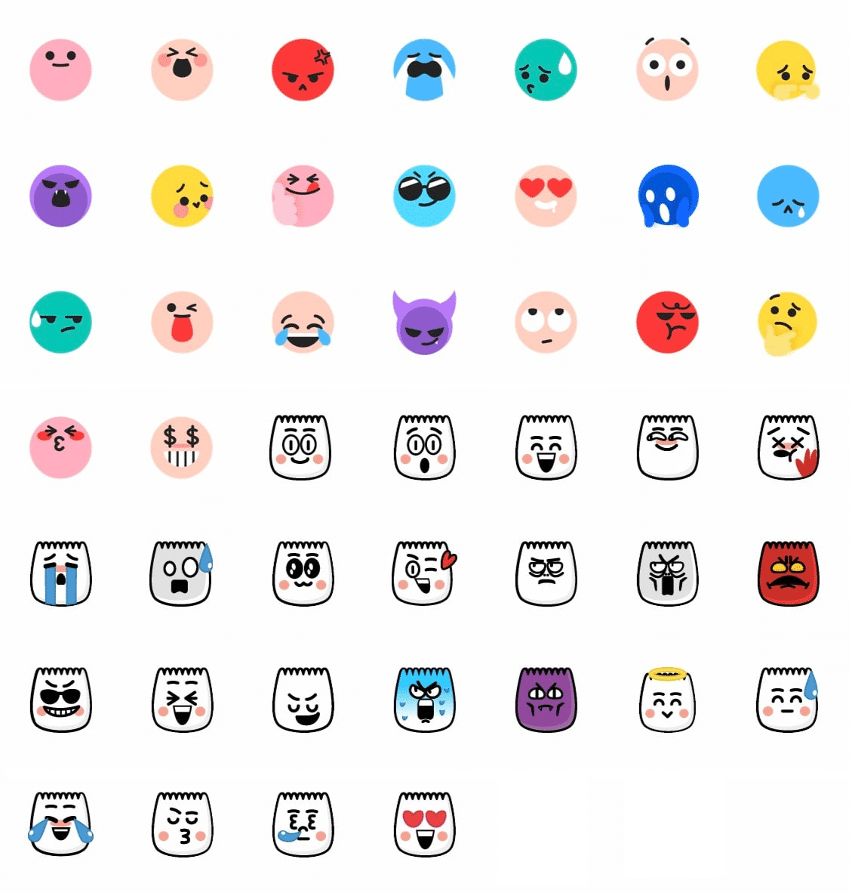

# TikTok Emojis - Ultimate Collection & Copy Tool

<div align="center">
  
  
  
  ### [TikTokEmojis.cc](https://tiktokemojis.cc) - The Most Comprehensive TikTok Emoji Resource
  
  [](https://tiktokemojis.cc)
  [](https://github.com/yourusername/tiktok-emojis/stargazers)
  [](LICENSE)
  
</div>

## 🚀 About TikTok Emojis

[TikTokEmojis.cc](https://tiktokemojis.cc) is the internet's most complete collection of TikTok emojis, featuring all 46 secret TikTok emoji codes that can transform your content creation. Our platform offers easy-to-use tools for creators, influencers, and TikTok enthusiasts to discover, copy, and download high-quality TikTok emoji images.

### 🌟 Why TikTok Emojis Matter

TikTok emojis are unique symbols that can only be displayed by typing specific codes in TikTok comments and captions. Unlike standard emojis, these hidden TikTok emojis are exclusive to the platform and help content creators:

- Stand out in comments sections with exclusive TikTok emojis
- Create more engaging content with TikTok-specific expressions
- Build community through shared secret TikTok emoji knowledge
- Express emotions more authentically with platform-native TikTok emojis

## ✨ Features of TikTokEmojis.cc

### 🔍 Complete TikTok Emoji Collection
- **46 Secret TikTok Emojis** - The most comprehensive collection available
- **8 Emotion Categories** - Browse TikTok emojis by mood (Happy, Proud, Crying, etc.)
- **Detailed Descriptions** - Learn each TikTok emoji's meaning and best usage

### 🛠️ Essential Creator Tools
- **One-Click Copy** - Instantly copy TikTok emoji codes to your clipboard
- **PNG Downloads** - High-quality transparent TikTok emoji images for content creation
- **Advanced Search** - Find the perfect TikTok emoji by name, emotion, or keyword
- **Usage Guides** - Learn strategic ways to boost engagement with TikTok emojis

### 💻 Technical Excellence
- **Lightning Fast** - Built with Next.js 14 App Router for optimal performance
- **Mobile Optimized** - Perfect experience on any device
- **Accessibility Focus** - Inclusive design for all users
- **Dark Mode Support** - Easy on the eyes during late-night content creation

## 🚀 Website Sections

- [**Home**](https://tiktokemojis.cc) - Featured TikTok emojis and search
- [**All TikTok Emojis**](https://tiktokemojis.cc/all-tiktok-emojis) - Browse the complete collection
- [**TikTok Emoji Codes**](https://tiktokemojis.cc/tiktok-emoji-codes) - Secret codes for comments and captions
- [**Download TikTok Emojis**](https://tiktokemojis.cc/tiktok-emojis-download) - High-quality PNG images
- [**How to Use**](https://tiktokemojis.cc/how-to-use-tiktok-emojis) - Tips and best practices

## 🌐 TikTok Emoji Categories

- **Happy TikTok Emojis** - Express joy and excitement ([view collection](https://tiktokemojis.cc/emojis/category/happy-tiktok-emoji))
- **Proud TikTok Emojis** - Show confidence and accomplishment ([view collection](https://tiktokemojis.cc/emojis/category/proud-tiktok-emoji))
- **Crying TikTok Emojis** - Convey sadness and emotion ([view collection](https://tiktokemojis.cc/emojis/category/sad-tiktok-emoji))
- **Surprised TikTok Emojis** - React to shocking content ([view collection](https://tiktokemojis.cc/emojis/category/surprised-tiktok-emoji))
- **Angry TikTok Emojis** - Express frustration and displeasure ([view collection](https://tiktokemojis.cc/emojis/category/angry-tiktok-emoji))
- **Cute TikTok Emojis** - Add adorable reactions ([view collection](https://tiktokemojis.cc/emojis/category/cute-tiktok-emoji))
- **Smug TikTok Emojis** - Show mischievous confidence ([view collection](https://tiktokemojis.cc/emojis/category/smug-tiktok-emoji))
- **Other TikTok Emojis** - Unique expressions that defy categorization ([view collection](https://tiktokemojis.cc/emojis/category/other-tiktok-emoji))

## 💻 Technology Stack

This project leverages modern web technologies to deliver the best TikTok emoji experience:

- **Framework**: Next.js 14 (App Router)
- **Language**: TypeScript
- **Styling**: Tailwind CSS v4
- **UI Components**: Shadcn/ui
- **Icons**: Lucide React
- **SEO**: Next.js Metadata API + custom sitemap generation

## 🔧 Local Development

```bash
# Clone the repository
git clone https://github.com/yourusername/tiktok-emojis.git
cd tiktok-emojis

# Install dependencies
npm install

# Start development server
npm run dev

# Build for production
npm run build
```

## 📊 SEO Strategy

[TikTokEmojis.cc](https://tiktokemojis.cc) implements a comprehensive SEO strategy targeting:

- **Primary Keywords**: tiktok emojis, tiktok emoji codes, secret tiktok emojis
- **Secondary Keywords**: hidden tiktok emojis, tiktok emoji png, download tiktok emojis
- **Long-tail Keywords**: how to use tiktok emojis, all tiktok emojis collection

Our content structure is built around these keywords with semantic HTML, optimized meta tags, canonical URLs, and a complete sitemap.

## 🎯 Business Impact

- **Enhanced Content Creation** - TikTok creators can express themselves more effectively
- **Improved Engagement** - Strategic TikTok emoji usage increases comment interactions
- **Platform Expertise** - Users gain insider knowledge of exclusive TikTok features
- **Time Savings** - Instant access to all TikTok emojis without searching

## 🔮 Future Development

- Animated TikTok emoji previews
- Custom TikTok emoji combination generator
- Engagement analytics integration
- Trending TikTok emoji usage data

## 📄 License

This project is licensed under the MIT License - see the [LICENSE](LICENSE) file for details.

---

<div align="center">
  
  **[Visit TikTokEmojis.cc Today →](https://tiktokemojis.cc)**
  
  The ultimate resource for TikTok emojis, helping creators enhance their content since 2023.
  
</div>
